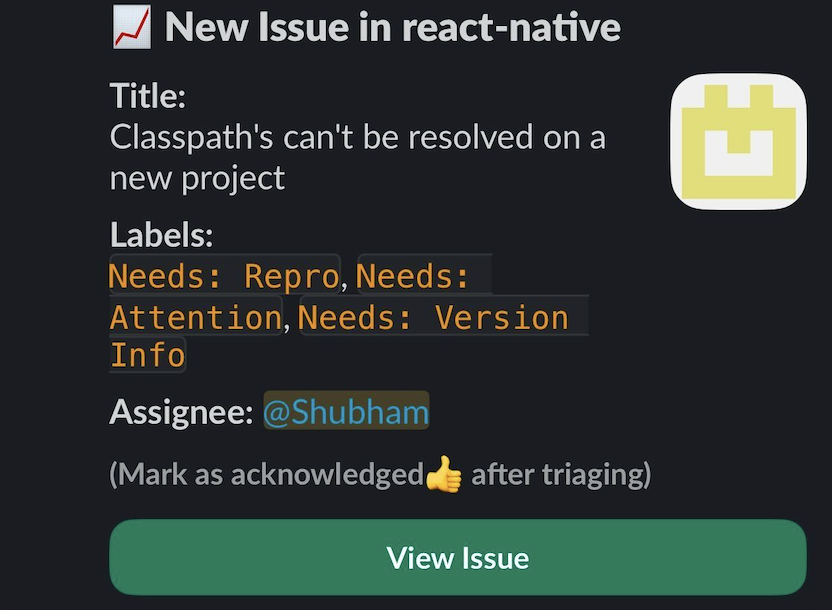
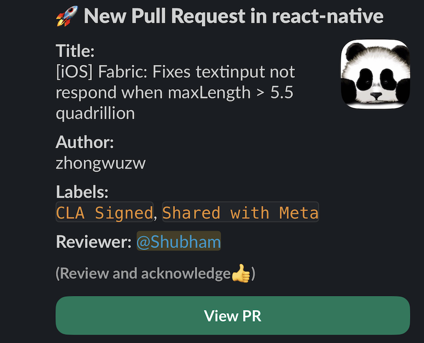
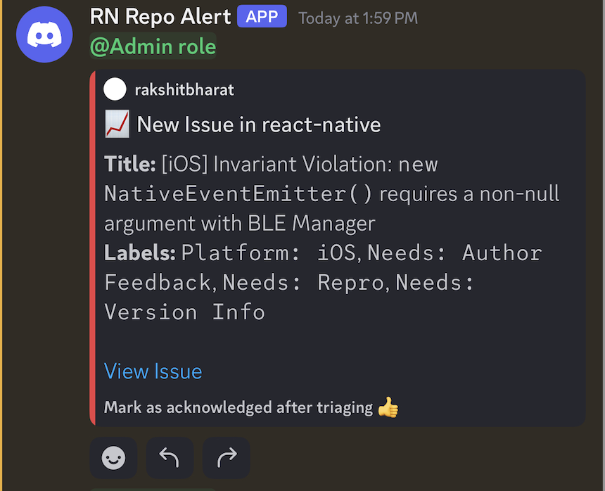
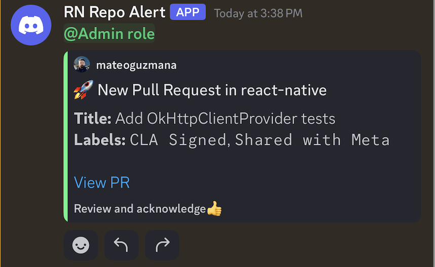

# Monitor Issues & PRs with Slack+Discord Notifications

Managing activity in open-source repositories can be challenging. With a constant influx of **issues** and **pull requests**, it's easy to lose track of what needs attention—especially when working with large teams or active projects. Missed notifications or delayed responses can lead to bottlenecks, reduced contributor satisfaction, and slower project progress.

## Repo Activity Monitor

This [GitHub Action](https://github.com/marketplace/actions/repo-activity-monitor) empowers open-source maintainers by:

- Tracking new issues and pull requests.
- Sending auto-generated notifications to **Slack** or **Discord**.
- Customizing **Slack** notifications with the ability to ping multiple users or groups.
- Customizing **Discord** notifications with the ability to ping multiple users or roles.
- Allowing **Slack** notifications to be sent to designated channels.

With **Repo Activity Monitor**, you can stay on top of your repositories activities, streamline communication, and ensure no critical issues or pull requests fall through the cracks.

## Usage

### Monitoring Issues with Slack

```yml
name: Monitor GitHub Repo

on:
  schedule:
    - cron: "0 * * * *" # Runs every hour
  workflow_dispatch: # Optional

jobs:
  run-notifier:
    runs-on: ubuntu-latest
    steps:
      - name: Set up Node.js
        uses: actions/setup-node@v4
        with:
          node-version: '20'
      - name: Monitor New Issues
        uses: shubhaamgupta11/repo-monitor@v1.0.0
        with:
          # required inputs
          task: "monitor-issues"
          git_secret: "${{ secrets.GIT_SECRET }}"
          notifier: "slack"
          fetch_data_interval: 1  # Hours (must align with your cron schedule)
          # repo inputs
          repo_owner: "<owner>"
          repo_name: "<repo>"
          # Slack-specific inputs
          slack_bot_token: "${{ secrets.SLACK_BOT_TOKEN }}"
          slack_channel: "<channel-id>"
          slack_id_type: "<user/group>" # Optional: Only needed to ping someone directly.
          slack_ids: "<user-id/group-id>" # Optional: Only needed if slack_id_type is provided. Can pass multiple similar type ids separated by commas. e.g. "Uyyyxxxx,Uzzzxxxx"
```

> **Note:** slack_id_type and slack_id are only needed if you want to ping someone directly.

### Monitoring PRs with Discord

```yml
name: Monitor GitHub Repo

on:
  schedule:
    - cron: "0 * * * *" # Runs every hour
  workflow_dispatch: # Optional to trigger manually

jobs:
  run-notifier:
    runs-on: ubuntu-latest
    steps:
      - name: Set up Node.js
        uses: actions/setup-node@v4
        with:
          node-version: '20'
      - name: Monitor New PRs
        uses: shubhaamgupta11/repo-monitor@v1.0.0
        with:
          # required inputs
          task: "monitor-prs"
          git_secret: "${{ secrets.GIT_SECRET }}"
          notifier: "discord"
          fetch_data_interval: 1  # Hours (must align with your cron schedule)
          # repo inputs
          repo_owner: "<owner>"
          repo_name: "<repo>"
          # Discord-specific inputs
          discord_webhook_url: "${{ secrets.DISCORD_WEBHOOK_URL }}"
          discord_id_type: "<user/role>" # Optional: Only needed to ping someone directly.
          discord_ids: "<user-id/role-id>" # Optional: Only needed if discord_id_type is provided. Can pass multiple similar type ids separated by commas. e.g. "Uyyyxxxx,Uzzzxxxx"
```

> **Note:** You can configure any notifier (slack, discord) for any task (monitor-issues, monitor-prs, etc.). 

## Message Previews
Below are examples of how the notifications look on Slack and Discord.

### Slack Notification Previews
<details> <summary>Click to view Slack notifications</summary>

For Issues



For Pull Requests

 </details>

### Discord Notification Previews
<details> <summary>Click to view Discord notifications</summary>

For Issues



For Pull Requests

 </details>


## 🔧 Inputs

| Input | Description | Required | Default |
| ----- | ----------- | -------- | ------- |
| task | The task to run (monitor-issues or monitor-prs). | Yes | None |
| git_secret | GitHub token for authentication. | Yes | None |
| repo_owner | The owner of the GitHub repository (`user-name`). | Yes | None |
| repo_name | The name of the GitHub repository (`repo-name`). | Yes | None |
| fetch_data_interval | The time interval to fetch data for (e.g., 1 hour, 24 hours). This should align with the cron schedule. | Yes | None |
| notifier | Notification method (**slack** or **discord**). | Yes | None |
| slack_bot_token | Slack bot token to send notifications (required if notifier=`slack`). | No | None |
| slack_channel | The Slack channel id to send notifications to (required if notifier=`slack`). | No | None |
| slack_id_type | Type of Slack ID (user or group, required if notifier=`slack`). This is needed to ping someone directly. | No | None |
| slack_ids | user id or group id as per `slack_id_type` (required if notifier=`slack`). Can pass multiple similar type ids separated by commas. e.g. "Uyyyxxxx,Uzzzxxxx" | No | None |
| discord_webhook_url | Discord webhook URL to send notifications (required if notifier=`discord`). | No | None |
| discord_id_type | Type of Discord ID (user or role, required if notifier=`discord`). This is needed to ping someone directly. | No | None |
| discord_ids | user id or role id as per `discord_id_type` (required if notifier=`discord`). Can pass multiple similar type ids separated by commas. e.g. "Uyyyxxxx,Uzzzxxxx" | No | None |

## 📖 How It Works
- The action listens for new issues or PRs in the specified GitHub repository.
- Depending on the `task` input, it will either monitor new issues (`monitor-issues`) or pull requests (`monitor-prs`).
- Once a new issue or PR is detected, it sends a notification via Slack or Discord based on the `notifier` input.
- The action checks for issues or PRs within the time period defined by `fetch_data_interval`, which should align with the cron schedule. For example, if the cron schedule is set to run every hour `(0 * * * *)`, set `fetch_data_interval` to 1 hour.

## 🔧 Setting Up

### Slack

- Create a [Slack App](https://api.slack.com/quickstart).
- Generate a Slack Bot Token.
- Retrieve the Channel ID and User/Group IDs.
- Add these secrets to your GitHub repository:
  - `SLACK_BOT_TOKEN`
- Provide the Slack Channel ID, Slack ID Type and Slack ID in the workflow.

### Discord

- Create a [Discord Webhook](https://support.discord.com/hc/en-us/articles/228383668-Intro-to-Webhooks).
- Copy the Webhook URL.
- Add the Webhook URL to your GitHub repository secrets as `DISCORD_WEBHOOK_URL`.
- Retrieve the User/Role IDs.
- Add these secrets to your GitHub repository:
  - `DISCORD_WEBHOOK_URL`
- Provide the Discord Webhook URL, Discord ID Type and Discord ID in the workflow.

## 🔮 Roadmap

- [ ] **Generalize Notification Channels**: Allow adding multiple notification methods (e.g.  Webhooks, MS Teams).
- [ ] **Support Custom Filters**: Enable users to apply filters like labels, authors, or milestones to issues and PRs.
- [ ] **Handle API Rate Limiting**: Add rate limiting or retry logic for handling GitHub API rate limits.
- [ ] **Track inactivity** on issues and notify users after a specific TAT (Turnaround Time).

## 📜 License

This project is licensed under the [MIT License](https://github.com/shubhaamgupta11/repo-monitor/blob/main/LICENSE).

## Support & Feedback
If you find this action helpful, please give the repository a ⭐️ on GitHub! Your support helps us grow and continue improving. Feel free to raise issues or suggest enhancements to make this even better.
